# Health Insurance Coverage Gap Analysis and Machine Learning Model for Medicaid Expansion Impact

**How much did Medicaid expansion cut the number of low-income adults without health insurance, which places
gained the most, and what would happen if the remaining states expanded? Built from real Census data on every
US county, 2008-2023.**

> **In short:** since 2014, most states have let adults with low incomes get free health coverage through Medicaid
> (this is called "Medicaid expansion"). Ten states still have not. Using government data for all 3,143 US
> counties, this project shows that:
>
> * In states that expanded in 2014, the share of low-income adults with no health insurance fell from **37% to 16%**.
>   In states that did not expand it fell less, from **46% to 29%**.
> * Part of that drop would have happened anyway (other health reforms also started in 2014). Comparing similar
>   counties, **expansion itself cut the uninsured rate by about 6 percentage points** and kept about
>   **970,000 more adults insured in 2023**.
> * A machine learning model predicts that if the **10 remaining states** expanded, about **530,000 more adults**
>   would have health insurance, **44% of them in Texas**. The places with the highest uninsured rates today would
>   gain the most.

[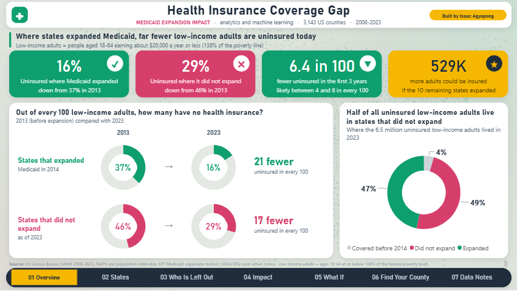](dashboard/)

*The Power BI dashboard (6 pages). More screenshots below.*

---

*The sections below go into technical detail.*

## The questions

1. **Analytics:** where are low-income adults still uninsured, how did that change from 2008 to 2023, and how do
   states that expanded Medicaid compare with states that did not, by income, area and race?
2. **Causal effect:** how much of the drop was caused by expansion itself, rather than by everything else that
   happened after 2014?
3. **Machine learning:** which counties gained the most from expansion, and which counties in the remaining states
   would gain the most if their state expanded?

Main outcome throughout: the **uninsured rate of adults 18-64 with income at or below 138% of the federal poverty
level**, the group expansion made eligible. All rates are population-weighted.

## Key findings

| # | Finding | Evidence |
|---|---|---|
| 1 | In the 21 states that expanded in 2014 the low-income adult uninsured rate fell from **37.4% (2013) to 17.7% (2016) and 16.0% (2023)**; in states that had not expanded by 2023 it fell from **45.9% to 34.0% and 29.4%**. | `05_business_questions.sql` Q1 |
| 2 | The gap between the two groups **nearly doubled, from 8.5 to 16.4 points, in 2014-2016** and was still 13.5 points in 2023. | Q2 |
| 3 | **Expansion caused a 6.4-point drop** in the uninsured rate over its first three years (95% CI 4.2 to 7.8 points), measured against similar counties in states that did not expand. Before expansion the two groups moved in parallel (average pre-trend difference 0.1 points). | `05_causal_effects.py` |
| 4 | About **970,000 more low-income adults were insured in 2023 because of expansion** in the 33 expansion states studied (95% CI 240,000 to 1.29 million). | `05_causal_effects.py` |
| 5 | The effect is concentrated where the policy applied: **a fake 2011 expansion date shows no effect (+0.0)**, and adults at 138-400% of poverty, who were not made eligible, show a much smaller change (-2.8 points). | `05_causal_effects.py`, Q6 |
| 6 | Counties with **more poverty and more uninsured adults before expansion gained the most**: -8.2 points in the highest-uninsured quarter vs -4.0 in the lowest. | `06_ml_county_effects.py` |
| 7 | **7 of the 10 states with the highest uninsured rates in 2023 had not expanded**; Texas is highest at 39.6%. The 5 biggest drops since 2013 were all in expansion states (Kentucky -28.0 points, Louisiana -27.1, California -26.0). | Q4, Q5 |
| 8 | The 12 states that had not expanded by 2023 hold **49% of all uninsured low-income adults (3.2 million of 6.5 million)**. | Q10 |
| 9 | Hispanic low-income adults have the highest uninsured rates: **46% in non-expansion states and 27% even in expansion states** (2023). | Q8 |
| 10 | If the 10 remaining states expanded, the model predicts about **530,000 more adults would be insured**: Texas 230,000, Florida 99,000, Georgia 64,000. | `06_ml_county_effects.py` |

## Recommendations

For state health agencies, legislators, hospitals and health plans:

1. **States weighing expansion:** based on what happened in similar counties, expansion would lower the uninsured
   rate of low-income adults by roughly 3 to 7 points in each remaining state (about 2 in Wisconsin, which already
   covers adults below the poverty line). In Texas that is about 230,000 people (from 40% uninsured to 32%); in
   Florida about 99,000 (27% to 22%).
2. **Target outreach where the effect is largest:** high-poverty counties with high uninsured rates gained about
   twice as much as low-poverty counties. The county table in the dashboard ranks where enrollment support would
   reach the most people (Harris, Dallas and Bexar counties in Texas lead).
3. **Expansion states are not done:** 16% of low-income adults in the 2014 expansion states are still uninsured,
   and 27% of Hispanic low-income adults. Many of them are likely eligible but not enrolled, which points to
   enrollment help and outreach in Spanish.
4. **Hospitals in non-expansion states:** counties such as Harris, Dallas, Hidalgo and El Paso (Texas), where
   44-47% of low-income adults are uninsured, carry the largest risk of unpaid care; this belongs in financial
   planning and charity-care budgets.

## Data sources

| Source | What it provides |
|---|---|
| [Census Small Area Health Insurance Estimates (SAHIE)](https://www.census.gov/programs-surveys/sahie.html), 2008-2023 | Uninsured and insured counts and rates for every county and state, by age, income and (states) race |
| [KFF: Status of State Medicaid Expansion Decisions](https://www.kff.org/affordable-care-act/issue-brief/status-of-state-medicaid-expansion-decisions/) | Expansion status and implementation date for every state |
| [Census SAIPE](https://www.census.gov/programs-surveys/saipe.html) 2013 | County poverty rate and median household income (baseline) |
| [Census county population estimates](https://www.census.gov/programs-surveys/popest.html) (vintage 2019, July 2013) | Population, age and race/ethnicity shares (baseline) |
| [USDA ERS Rural-Urban Continuum Codes 2013](https://www.ers.usda.gov/data-products/rural-urban-continuum-codes) | Metro, rural near a metro, remote rural |

All files are downloaded by `Python/01_download_data.py`; `Data/raw/manifest.json` records each URL, size and
SHA-256 checksum.

## How it works

```
Census SAHIE (16 yearly files) ─┐
KFF expansion table ────────────┤   Python/01_download_data.py (curl, manifest with checksums)
SAIPE, population, USDA ────────┘
                │
                ▼
PostgreSQL 18  (database medicaid_coverage, own tablespace on D:)
   raw        text columns, loaded with COPY                   01a_schema_raw.sql
   core       typed star schema: dim_state, dim_county,        01b_schema_core.sql, 02_transform.sql
              dim_age_group, dim_income_group,
              fact_county_coverage (1.6M rows), fact_state_coverage
   analytics  one view per business question +                 04_analytics_views.sql
              materialized county panel (3,035 counties x 16 years)
                │
     ┌──────────┼───────────────────────────┬──────────────────────────────┐
     ▼          ▼                           ▼                              ▼
 SQL checks   Difference-in-differences    Causal forest (EconML)         Power BI (PBIP, generated
 + business   Callaway & Sant'Anna,        county effects, held-out       from code; imports CSV
 questions    event study, placebos,       state validation, predictions  extracts of the views
 (03, 05)     bootstrap by state (05)      for non-expansion states (06)  and model outputs) (07, 08)
                                   │
                                   ▼
                     Python/04_analysis.ipynb (all charts and results)
```

## Data problems found and fixed

Every cleaning rule fixes a problem found while profiling the raw data (`SQL/02_transform.sql`,
`SQL/03_data_quality.sql`).

| Problem | Fix |
|---|---|
| The Census API now requires a registered key | Downloaded the same data as the Census bulk CSV files |
| KFF publishes expansion dates only inside a web page | Parsed the table the page embeds as CSV; saved it to `Data/raw/kff_expansion_status.csv` |
| Each SAHIE file starts with ~80 lines of layout text | Loader finds the header row instead of assuming its position |
| Missing values are stored as a `.` (Kalawao County HI, 510 rows; Loving County TX, 6 small subgroups) | Converted to NULL; neither county is in the analysis panel |
| Two counties changed FIPS code (Shannon SD became Oglala Lakota; Wade Hampton AK became Kusilvak) | Mapped old codes to new so each county has one 16-year history |
| Connecticut replaced its 8 counties with 9 planning regions in 2022; Alaska areas split in 2008 and 2020; Bedford city VA merged in 2013 | Balanced panel keeps only counties present in all 16 years (3,129 of 3,156) |
| Income group 138-400% starts in 2012, some age groups in 2014, extra race groups in 2021 | Each analysis uses only groups available for its whole window |
| Expansion dates fall mid-year (e.g. Louisiana July 2016, Alaska September 2015) | Effective year = first year with at least 6 months of expansion |
| North Carolina and South Dakota expanded in late 2023 | Treated as not yet expanded for every year observed |
| DE, DC, MA, NY and VT covered low-income adults before 2014 | Excluded from the effect estimate, as in the published research |
| 235 rows where uninsured / population differs from the published rate | All are groups under 100 people (separate rounding); no mismatches in 1.59M larger rows |

**Reconciliation with a published figure:** the Census press release for SAHIE 2023 (CB25-TPS.56) reports a median
county uninsured rate of **17.7%** for working-age adults at or below 138% of poverty (18.6% in 2022, 20.3% in 2021)
and **9.3%** for everyone under 65 (9.4%, 10.4%). This database reproduces all six medians exactly. County totals
also add up to state totals exactly in every year.

## Methods

**Difference-in-differences (`Python/05_causal_effects.py`).** Implemented directly (no black-box package) following
Callaway & Sant'Anna (2021): for each group of states that expanded in year *g*, the change in the uninsured rate from
year *g-1* is compared with the same change in counties of states that never expanded. This avoids the known bias of
the traditional two-way fixed-effects regression when states adopt at different times. The main estimate adjusts the
comparison for 2013 county traits (outcome-regression DiD), weights counties by their low-income adult population,
and gets 95% intervals from 499 bootstrap draws that resample whole states.

| Estimate (percentage points, first 3 years) | Value | 95% CI |
|---|---|---|
| **Main: adjusted for county traits** | **-6.4** | -7.8 to -4.2 |
| Without adjustment | -6.3 | -8.0 to -4.6 |
| Adults 138-400% of poverty (not made eligible) | -2.8 | -3.9 to -1.4 |
| Placebo: fake expansion in 2011 (2008-2013 data only) | +0.0 | -0.8 to +1.4 |
| All post-expansion years: Callaway & Sant'Anna vs two-way fixed effects | -7.4 vs -7.1 | |

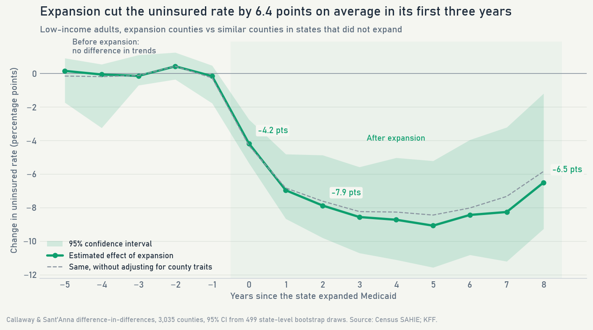

**Causal forest (`Python/06_ml_county_effects.py`).** EconML `CausalForestDML` (double machine learning with
gradient-boosted nuisance models, 2,000 honest trees) trained on "stacked" windows: each expansion wave from 2014 to
2021 compared with never-expanded counties over the same years. It estimates a separate effect for each county from
pre-expansion traits (uninsured rate and its trend, poverty, income, race and ethnicity, age, population,
rurality); cross-fitting folds are grouped by state so a county's state is never used to predict it.

* **Agrees with the difference-in-differences estimate:** average effect -6.46 vs -6.41 points.
* **Validated on states it never saw** (5 random 70/30 splits of states): counties the model ranked in the top
  quarter had an actual drop of **9.3 points** vs **4.5** in the bottom quarter, in the predicted order. The ranking
  held in 4 of the 5 splits.
* **Predictions** for counties in the 10 states that have not expanded use each county's 2023 situation.

| | |
|---|---|
| 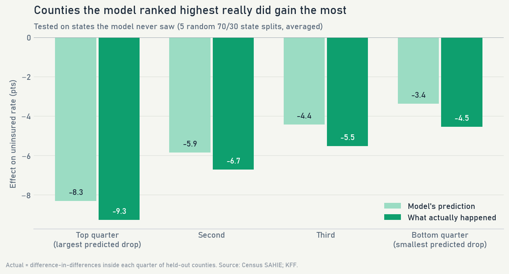 | 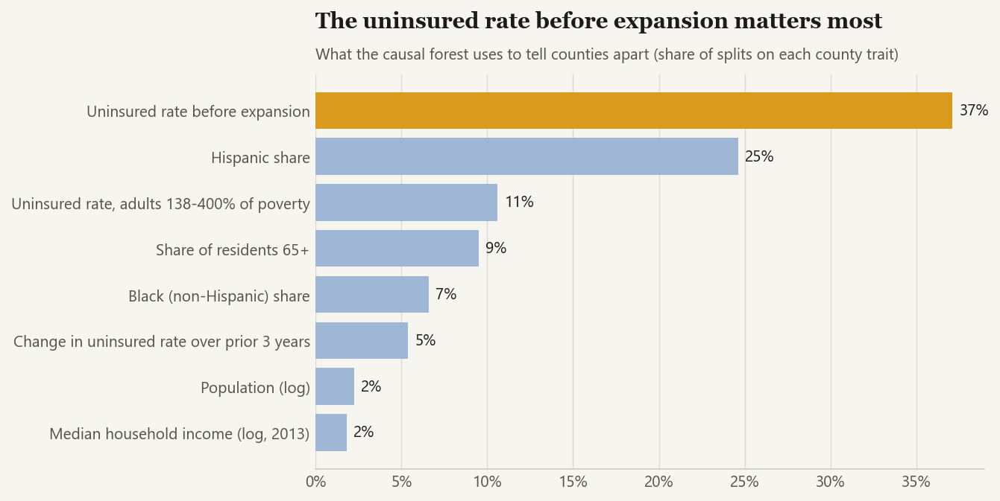 |

## Skills shown

* **SQL (PostgreSQL 18):** layered warehouse (raw, core star schema, analytics), COPY bulk loads, CTEs, window
  functions (LAG, RANK, NTILE, percent_rank, FIRST_VALUE), FILTER aggregates, percentile_cont, corr/regr_slope,
  DISTINCT ON, materialized view with a unique index, a data-quality suite and a reconciliation to published figures.
* **Python:** pandas, NumPy, psycopg 3, matplotlib; a Callaway & Sant'Anna difference-in-differences estimator with
  cluster bootstrap written from scratch; EconML causal forest with scikit-learn gradient boosting; held-out-group
  validation; notebook built with nbformat and executed with nbconvert.
* **Causal inference:** staggered difference-in-differences, event study, pre-trend checks, placebo tests,
  heterogeneous treatment effects, double machine learning.
* **Power BI:** report generated from Python as a PBIP (TMDL model, PBIR report), 58 DAX measures, a US tile map from
  a matrix with conditional formatting, a hover tooltip page, ranking measures that ignore map clicks, numbers checked
  against SQL through the Analysis Services engine.

## Charts

| | |
|---|---|
| 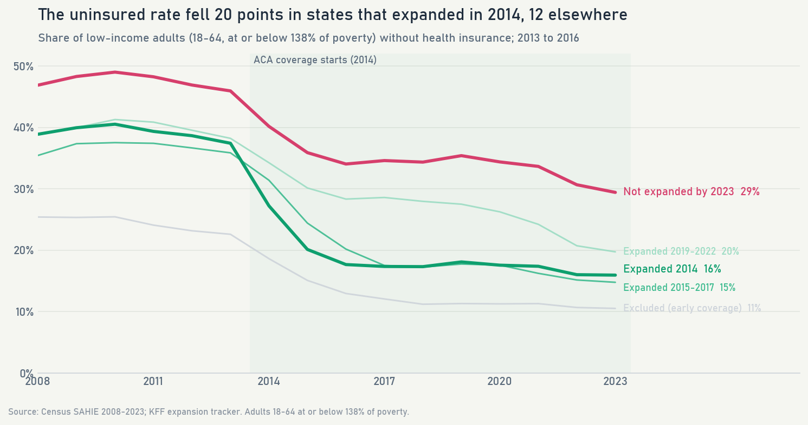 | 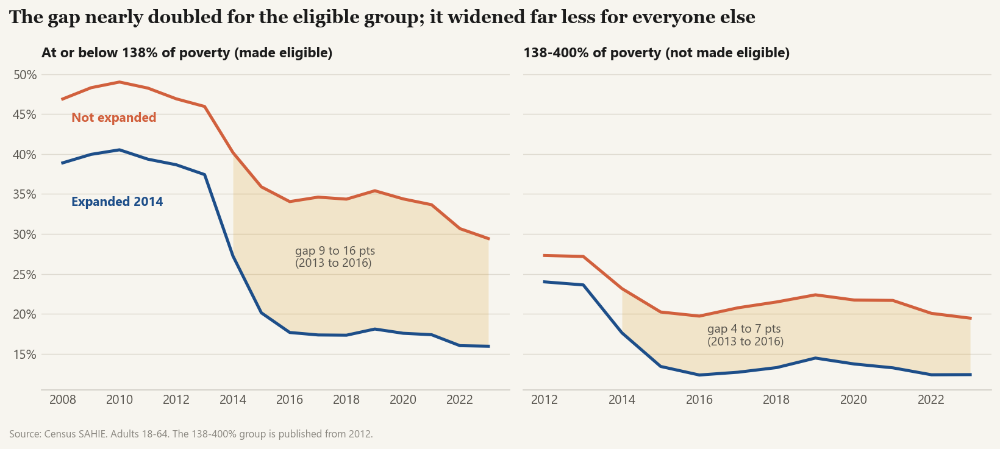 |
| 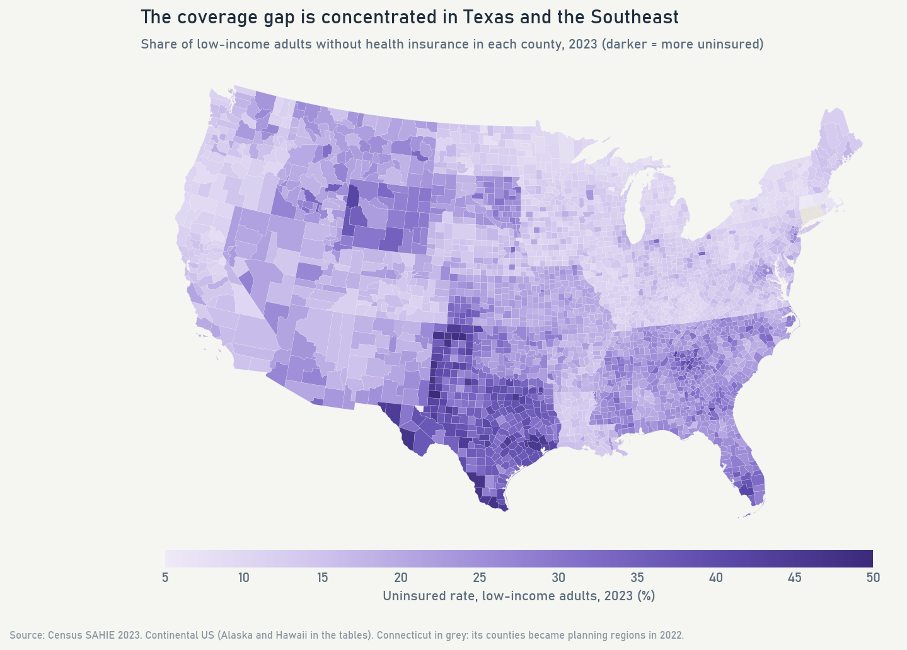 | 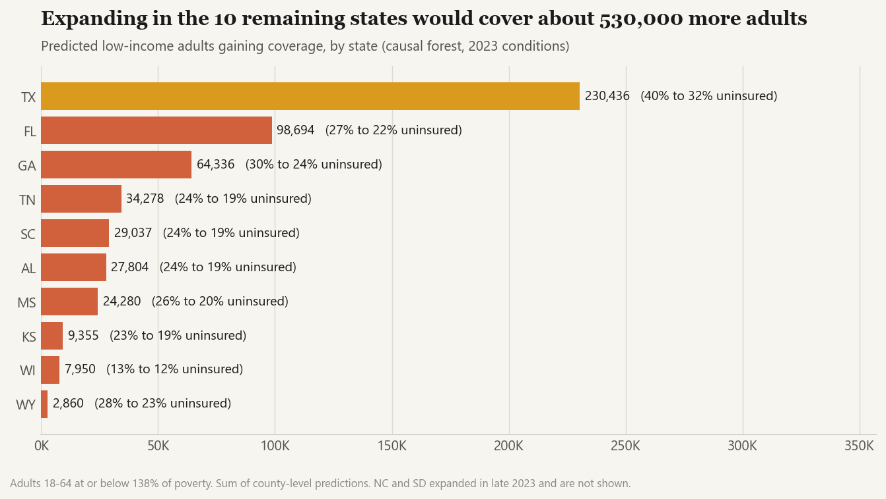 |

## Dashboard

Open `dashboard/Medicaid_Expansion.pbip` in Power BI Desktop. It imports the small CSV extracts in
`dashboard/data/`, so it works without the database; if you cloned the repository to another folder, change the
`DataFolder` parameter (Transform data > Edit parameters).

| | |
|---|---|
| 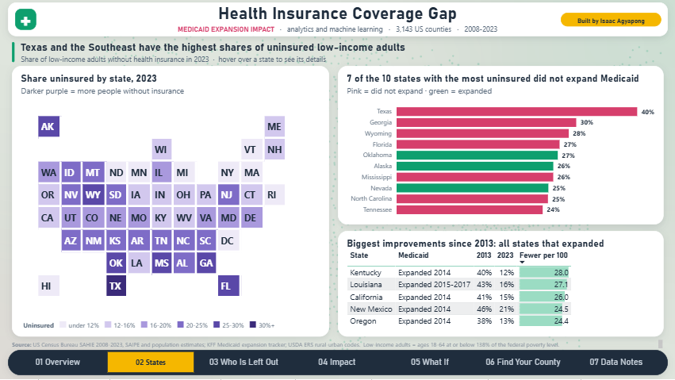 | 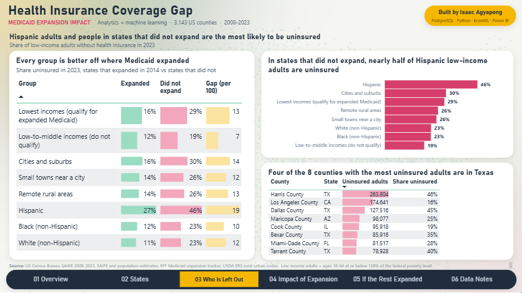 |
| 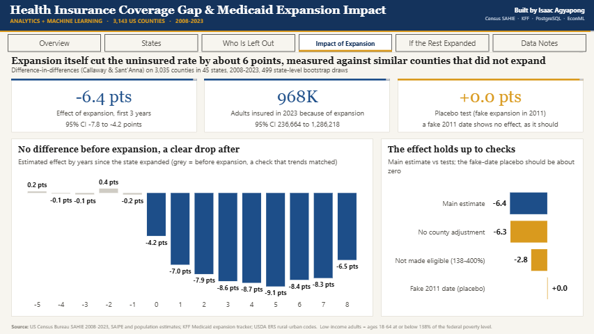 | 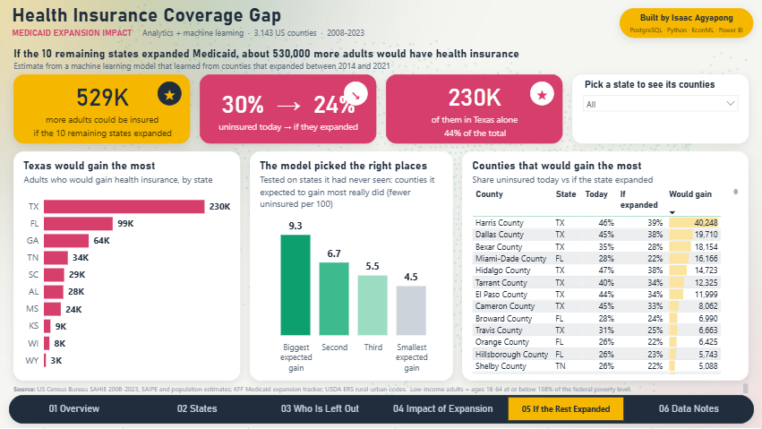 |

## Project structure

```
Data/raw/            source downloads (git-ignored) + manifest.json + KFF table
Data/clean/          model outputs (effects by year, county predictions, validation)
Python/
  01_download_data.py          download sources with curl, write manifest
  02_load_postgres.py          create database, load raw, build core + analytics
  03_run_sql_queries.py        run data-quality and business SQL -> SQL/query_results.md
  04_build_notebook.py         build and execute 04_analysis.ipynb
  05_causal_effects.py         difference-in-differences, placebos, bootstrap
  06_ml_county_effects.py      causal forest, validation, predictions
  07_export_powerbi.py         CSV extracts for the report
  08_build_powerbi_project.py  generate the Power BI project
  viz_style.py                 shared chart style
SQL/                 00-05 numbered scripts + query_results.md (every query with its output)
dashboard/           Power BI project (PBIP) + data extracts
models/              causal and machine learning results (JSON)
Image/               charts and dashboard screenshots
run_all.py           rebuild everything in order
```

## How to reproduce

1. Install Python 3.13 and PostgreSQL 18, then `pip install -r requirements.txt`.
2. Create a folder the PostgreSQL service can write to and set it in `SQL/00_create_database.sql` (the loader creates
   the database on first run). Connection settings come from the standard `PG*` environment variables and the
   password from `pgpass.conf`.
3. Run `python run_all.py` (about 10 minutes after the 330 MB download).
4. Open `dashboard/Medicaid_Expansion.pbip` in Power BI Desktop and click Refresh.

## Limitations

* SAHIE numbers are model-based estimates with margins of error (median about 4 points for a county's low-income
  adults). Large counties are more precise, which is why every model weights by population.
* States chose whether to expand. The design removes fixed differences between counties and changes shared by all
  states, and pre-expansion trends match, but a state-specific change at the same time as expansion would bias the
  estimate.
* SAHIE measures income over a year, while Medicaid uses monthly income, so some adults above 138% of poverty were
  eligible part of the year. This is one reason that group shows a small effect.
* The 970,000 estimate covers the 33 expansion states in the balanced county panel (it leaves out Connecticut and
  the 5 early-coverage states), so the national total is higher.
* Predictions assume expansion would work in the remaining states as it did in similar counties that expanded,
  under 2023 conditions. They estimate the drop in the uninsured rate, not Medicaid enrollment.

---

Built by **Isaac Agyapong** · [GitHub](https://github.com/Isaac-Agyapong) · Data: US Census Bureau, KFF, USDA ERS
