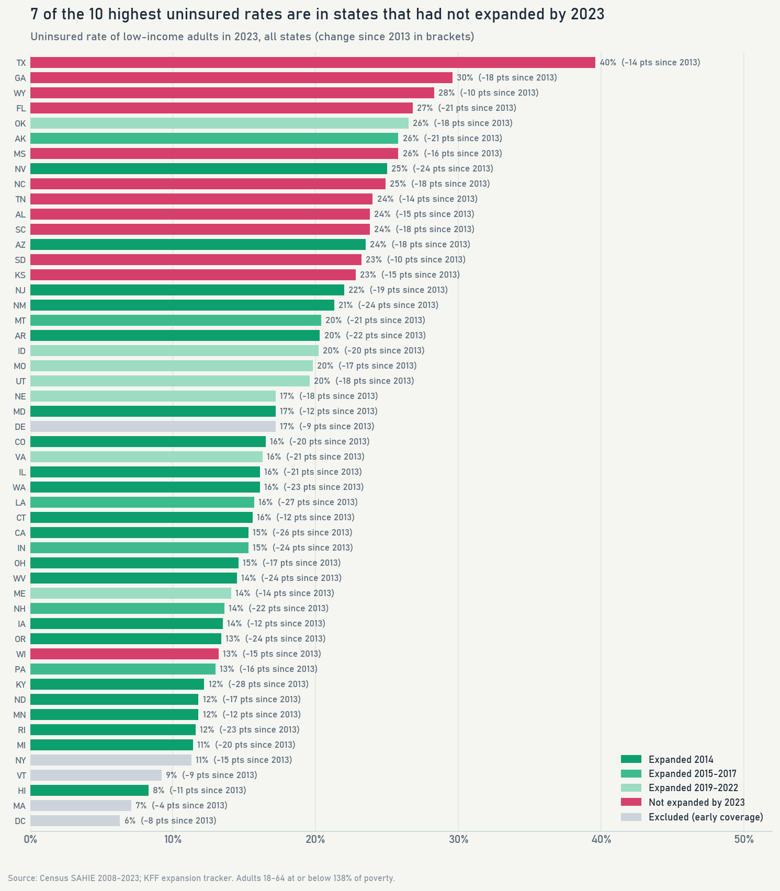
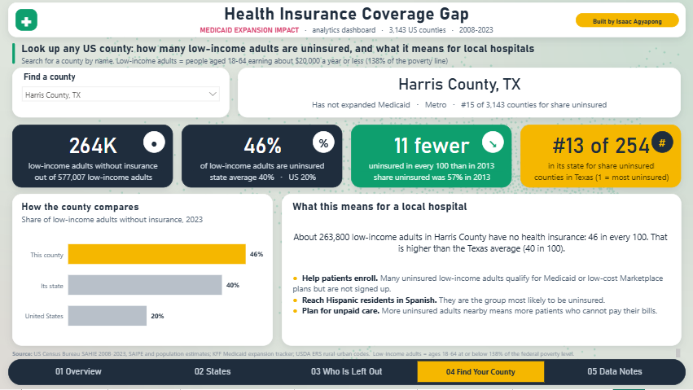

# Health Insurance Coverage Gap Analysis

**Where are low-income adults still without health insurance, how did that change from 2008 to 2023, and how do
states that expanded Medicaid compare with states that did not? Built from real Census data on every US county, with
a PostgreSQL warehouse, SQL analysis and a 5-page Power BI dashboard.**

> **In short:** Medicaid is free or low-cost government health insurance for people with low incomes. Since 2014,
> most states have let more low-income adults qualify for it (this is called "Medicaid expansion"); ten states still
> have not. Using government data for all 3,143 US counties, I built a database, an analysis and an interactive
> dashboard that show:
>
> * In states that expanded in 2014, the share of low-income adults with no health insurance fell from **37% to 16%**.
>   In states that did not expand it fell less, from **46% to 29%**. Today, people in states that did not expand are
>   **almost twice as likely** to be uninsured.
> * About **6.5 million** low-income adults were still uninsured in 2023, and **half of them** live in the states that
>   had not expanded. **Texas** has the highest share (**40%**), and **Hispanic** adults are the most likely to be
>   uninsured (46% in states that did not expand).
> * Anyone can look up their own county on the dashboard, for example a hospital planning for uninsured patients.
>
> How much of the drop expansion itself caused, and what would happen if the remaining states expanded, is answered
> by the companion machine learning project:
> **[Machine Learning Model for Medicaid Expansion Impact](https://github.com/Isaac-Agyapong/Medicaid_Expansion_Impact_Model)**.

[](dashboard/)

*The Power BI dashboard (5 pages). More screenshots below.*

---

*The sections below go into technical detail.*

## The questions

1. Where are low-income adults still uninsured, and how has that changed from 2008 to 2023?
2. How do states that expanded Medicaid compare with states that did not, overall and by income, area and race?
3. Which states and counties have the largest coverage gaps today?

Main outcome throughout: the **uninsured rate of adults 18-64 with income at or below 138% of the federal poverty
level** (about $20,000 a year for one person), the group Medicaid expansion made eligible. All rates are
population-weighted.

## Key findings

| # | Finding | Evidence |
|---|---|---|
| 1 | In the 21 states that expanded in 2014 the low-income adult uninsured rate fell from **37.4% (2013) to 17.7% (2016) and 16.0% (2023)**; in states that had not expanded by 2023 it fell from **45.9% to 34.0% and 29.4%**. | `SQL/05_business_questions.sql` Q1 |
| 2 | The gap between the two groups **nearly doubled, from 8.5 to 16.4 points, in 2014-2016** and was still 13.5 points in 2023. | Q2 |
| 3 | For adults at 138-400% of poverty, who were **not** made eligible, the gap widened much less (4 to 7 points, 2013-2016) than for eligible adults (9 to 16 points). | Q6 |
| 4 | **7 of the 10 states with the highest uninsured rates in 2023 had not expanded**; Texas is highest at 39.6%. The 5 biggest drops since 2013 were all in expansion states (Kentucky -28.0 points, Louisiana -27.1, California -26.0). | Q4, Q5 |
| 5 | The 12 states that had not expanded by 2023 hold **49% of all uninsured low-income adults (3.2 million of 6.5 million)**. | Q10 |
| 6 | Hispanic low-income adults have the highest uninsured rates: **46% in non-expansion states and 27% even in expansion states** (2023). | Q8 |
| 7 | Cities, small towns and remote rural areas all fell by about 20-22 points in expansion states and 15-17 in non-expansion states; the rural-urban split matters far less than the state's decision. | Q7 |
| 8 | The largest county coverage gaps are in big Texas and Florida counties: Harris County TX alone has about **264,000** uninsured low-income adults (46%). | Q9 |

## Recommendations

For state health agencies, hospitals and health plans:

1. **Target outreach where the gap is largest:** the Find Your County page ranks counties by how many low-income
   adults are uninsured; Harris, Dallas, Bexar and Tarrant counties in Texas lead the country.
2. **Expansion states are not done:** 16% of low-income adults in the 2014 expansion states are still uninsured,
   and 27% of Hispanic low-income adults. Many are likely eligible but not enrolled, which points to enrollment help
   and outreach in Spanish.
3. **Hospitals in non-expansion states:** counties such as Harris, Dallas, Hidalgo and El Paso (Texas), where
   44-47% of low-income adults are uninsured, carry the largest risk of unpaid care; this belongs in financial
   planning and charity-care budgets.
4. **States weighing expansion:** the companion machine learning project estimates what expansion would change in
   each remaining state (about 530,000 more adults insured across the 10 states).

## Data sources

| Source | What it provides |
|---|---|
| [Census Small Area Health Insurance Estimates (SAHIE)](https://www.census.gov/programs-surveys/sahie.html), 2008-2023 | Uninsured and insured counts and rates for every county and state, by age, income and (states) race |
| [KFF: Status of State Medicaid Expansion Decisions](https://www.kff.org/affordable-care-act/issue-brief/status-of-state-medicaid-expansion-decisions/) | Expansion status and implementation date for every state |
| [Census SAIPE](https://www.census.gov/programs-surveys/saipe.html) 2013 | County poverty rate and median household income |
| [Census county population estimates](https://www.census.gov/programs-surveys/popest.html) (vintage 2019, July 2013) | Population, age and race/ethnicity shares |
| [USDA ERS Rural-Urban Continuum Codes 2013](https://www.ers.usda.gov/data-products/rural-urban-continuum-codes) | Metro, rural near a metro, remote rural |

All files are downloaded by `Python/01_download_data.py`; `Data/raw/manifest.json` records each URL, size and
SHA-256 checksum.

## How it works

```
Census SAHIE (16 yearly files) ─┐
KFF expansion table ────────────┤   Python/01_download_data.py (curl, manifest with checksums)
SAIPE, population, USDA ────────┘
                │
                ▼
PostgreSQL 18  (database medicaid_coverage, own tablespace on D:)
   raw        text columns, loaded with COPY                   01a_schema_raw.sql
   core       typed star schema: dim_state, dim_county,        01b_schema_core.sql, 02_transform.sql
              dim_age_group, dim_income_group,
              fact_county_coverage (1.6M rows), fact_state_coverage
   analytics  one view per business question +                 04_analytics_views.sql
              materialized county panel (3,035 counties x 16 years)
                │
     ┌──────────┼──────────────────────────┬───────────────────────────────────────┐
     ▼          ▼                          ▼                                       ▼
 SQL checks   Python/04_analysis.ipynb     Power BI (PBIP generated from code;     Companion ML project
 + business   (charts, county map)         imports CSV extracts of the views)      reads the county panel
 questions                                 Python/05-06                            (Medicaid_Expansion_Impact_Model)
 (03, 05)
```

## Data problems found and fixed

Every cleaning rule fixes a problem found while profiling the raw data (`SQL/02_transform.sql`,
`SQL/03_data_quality.sql`).

| Problem | Fix |
|---|---|
| The Census API now requires a registered key | Downloaded the same data as the Census bulk CSV files |
| KFF publishes expansion dates only inside a web page | Parsed the table the page embeds as CSV; saved it to `Data/raw/kff_expansion_status.csv` |
| Each SAHIE file starts with ~80 lines of layout text | Loader finds the header row instead of assuming its position |
| Missing values are stored as a `.` (Kalawao County HI, 510 rows; Loving County TX, 6 small subgroups) | Converted to NULL; neither county is in the analysis panel |
| Two counties changed FIPS code (Shannon SD became Oglala Lakota; Wade Hampton AK became Kusilvak) | Mapped old codes to new so each county has one 16-year history |
| Connecticut replaced its 8 counties with 9 planning regions in 2022; Alaska areas split in 2008 and 2020; Bedford city VA merged in 2013 | Balanced panel keeps only counties present in all 16 years (3,129 of 3,156) |
| Income group 138-400% starts in 2012, some age groups in 2014, extra race groups in 2021 | Each analysis uses only groups available for its whole window |
| Expansion dates fall mid-year (e.g. Louisiana July 2016, Alaska September 2015) | Effective year = first year with at least 6 months of expansion |
| North Carolina and South Dakota expanded in late 2023 | Grouped with states that had not expanded by 2023 |
| DE, DC, MA, NY and VT covered low-income adults before 2014 | Shown as a separate group ("covered before 2014") |
| 235 rows where uninsured / population differs from the published rate | All are groups under 100 people (separate rounding); no mismatches in 1.59M larger rows |

**Reconciliation with a published figure:** the Census press release for SAHIE 2023 (CB25-TPS.56) reports a median
county uninsured rate of **17.7%** for working-age adults at or below 138% of poverty (18.6% in 2022, 20.3% in 2021)
and **9.3%** for everyone under 65 (9.4%, 10.4%). This database reproduces all six medians exactly. County totals
also add up to state totals exactly in every year.

## Skills shown

* **SQL (PostgreSQL 18):** layered warehouse (raw, core star schema, analytics), COPY bulk loads, CTEs, window
  functions (LAG, RANK, NTILE, percent_rank, FIRST_VALUE), FILTER aggregates, percentile_cont, corr/regr_slope,
  DISTINCT ON, materialized view with a unique index, a data-quality suite and a reconciliation to published figures.
* **Python:** pandas, psycopg 3, matplotlib; a US county map drawn from GeoJSON with an Albers projection; notebook
  built with nbformat and executed with nbconvert; curl-based downloads with checksums.
* **Power BI:** report generated from Python as a PBIP (TMDL model, PBIR report), 66 DAX measures, a US tile map and
  100-square "out of every 100" grids built from matrix visuals, a searchable county profile page with a default
  selection, a hover tooltip page, ranking measures that ignore map clicks, numbers checked against SQL through the
  Analysis Services engine.
* **Design for non-technical readers:** plain words ("16 in every 100", "about $20,000 a year"), no negative numbers,
  a glossary on the Data Notes page.

## Charts

| | |
|---|---|
|  |  |
|  |  |

## Dashboard

Open `dashboard/Medicaid_Expansion.pbip` in Power BI Desktop. It imports the small CSV extracts in
`dashboard/data/`, so it works without the database; if you cloned the repository to another folder, change the
`DataFolder` parameter (Transform data > Edit parameters).

| | |
|---|---|
|  |  |

**Find Your County:** search any of the 3,143 counties to see how many low-income adults are uninsured, how it
compares with its state and the US, how it changed since 2013, where it ranks in its state, and what that means for
a local hospital (enrollment help, Spanish-language outreach, planning for unpaid care).



## Project structure

```
Data/raw/            source downloads (git-ignored) + manifest.json + KFF table
Python/
  01_download_data.py          download sources with curl, write manifest
  02_load_postgres.py          create database, load raw, build core + analytics
  03_run_sql_queries.py        run data-quality and business SQL -> SQL/query_results.md
  04_build_notebook.py         build and execute 04_analysis.ipynb
  05_export_powerbi.py         CSV extracts for the report
  06_build_powerbi_project.py  generate the Power BI project
  make_background.py           dashboard background (county dot map)
  viz_style.py                 shared chart style
SQL/                 00-05 numbered scripts + query_results.md (every query with its output)
dashboard/           Power BI project (PBIP) + data extracts
Image/               charts and dashboard screenshots
run_all.py           rebuild everything in order
```

## How to reproduce

1. Install Python 3.13 and PostgreSQL 18, then `pip install -r requirements.txt`.
2. Create a folder the PostgreSQL service can write to and set it in `SQL/00_create_database.sql` (the loader creates
   the database on first run). Connection settings come from the standard `PG*` environment variables and the
   password from `pgpass.conf`.
3. Run `python run_all.py` (about 5 minutes after the 330 MB download).
4. Open `dashboard/Medicaid_Expansion.pbip` in Power BI Desktop and click Refresh.

## Limitations

* SAHIE numbers are model-based estimates with margins of error (median about 4 points for a county's low-income
  adults); rates are population-weighted so large, precise counties count more.
* Comparisons between states that did and did not expand are descriptive: those states differed before 2014 too.
  The companion machine learning project estimates how much of the difference expansion itself caused.
* SAHIE measures income over a year, while Medicaid uses monthly income, so some adults above 138% of poverty were
  eligible part of the year.

---

Built by **Isaac Agyapong** · [GitHub](https://github.com/Isaac-Agyapong) · Data: US Census Bureau, KFF, USDA ERS
